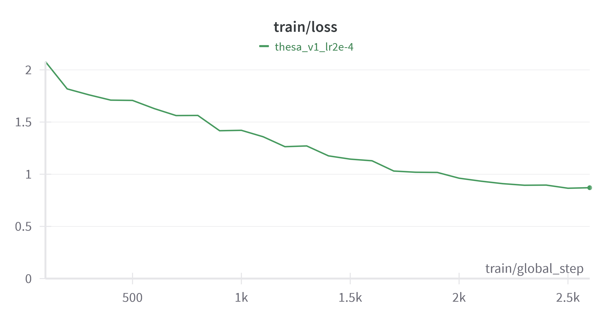

# Thesa: A Therapy Chatbot 👩🏻‍⚕️
[Thesa](https://huggingface.co/johnhandleyd/thesa) is an experimental project of a therapy chatbot trained on mental health data and fine-tuned with the Zephyr GPTQ model that uses quantization to decrease high computatinal and storage costs.

## Table of Contents
1. [Dataset(s)](#datasets)
2. [Training the model](#training-the-model)
3. [How to use](#how-to-use)
4. [Reproduce results](#reproduce-results)
5. [Results](#results)

## Dataset(s)
At the moment, Thesa is trained with two datasets:
- [CounselChat](https://huggingface.co/datasets/loaiabdalslam/counselchat) - extracted from HuggingFace
- [Mental Health Conversational Data](https://www.kaggle.com/datasets/elvis23/mental-health-conversational-data) - extracted from Kaggle

## Training the model
### Hardware
Thesa has been trained on Google Colab Pro, using a V100 GPU.

### Model architecture
- Model type: fine-tuned from [TheBloke/zephyr-7B-alpha-GPTQ](https://huggingface.co/TheBloke/zephyr-7B-alpha-GPTQ) on various mental health datasets
- Language(s): English
- License: MIT

### Intended uses & limitations

This model is purely experimental and should not be used as substitute for a mental health professional.

### Training loss 

## How to use
Thesa can be tested by running `playground.py`. Open it and edit the `example` and `prompt` variables as desired, then run the code.

Requirements: `transformers` installed and `inference.py` downloaded, though it's recommended to clone this entire repository.

## Reproduce results
1. Clone the repository: `git clone https://github.com/johnhandleyd/thesa`
2. Install dependencies via `pip install -r requirements`
3. Open `thesa.py` on your favourite code editor and run it!

## Results
To see a few samples, check out `results.md`.